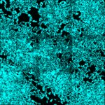

|  Method            | Parameters       | Quick Start Reader | Original Reader | Delta  |
| -------------------|------------------|--------------------|-----------------|------- |
| Initialization     |                  |5 ms|8 ms|        |
| Reader Size (Mb)     |                  |0.15|0.24|        |
# [split_hcr_probes_plasmid_pos_fov_tile3_Airyscan_Processing_Stitch.czi](https://zenodo.org/record/8015721/files/split_hcr_probes_plasmid_pos_fov_tile3_Airyscan_Processing_Stitch.czi) report
 - **Autostitch** = false
 - ZeissCZIReader v7.1.0
 - ZeissQuickStartCZIReader v0.2.4-SNAPSHOT

# Images 

| Series            | Quick Start Reader | Size | Original Reader | Size | #Diffs |
|-------------------|--------------------|------|-----------------|------|--------|
| Read time (all)   |834 ms|------|748 ms|------|--------|
|0||X:5314 Y:5294 C:2 Z:1 T:1||X:5314 Y:5294 C:2 Z:1 T:1|0|

# Metadata

