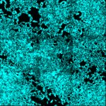

|  Method            | Parameters       | Quick Start Reader | Original Reader | Delta  |
| -------------------|------------------|--------------------|-----------------|------- |
| Initialization     |                  |4 ms|4 ms|        |
| Reader Size (Mb)     |                  |0.16|0.27|        |
| getPixelsSizeX| Image 0 | 5314| 5319| |
| getPixelsSizeY| Image 0 | 5294| 5301| |
| getStageLabelName| Image 1 | Scene position #0| Scene position #1| |
| getPixelsSizeX| Image 1 | 1771| 1773| |
| getPixelsSizeY| Image 1 | 1764| 1767| |
| getPixelsPhysicalSizeX| Image 1 | 0.051 um | 0.017 um | 0.034 um |
| getPixelsPhysicalSizeY| Image 1 | 0.051 um | 0.017 um | 0.034 um |
| getStageLabelName| Image 2 | Scene position #0| Scene position #2| |
| getPixelsSizeX| Image 2 | 590| 591| |
| getPixelsSizeY| Image 2 | 588| 589| |
| getPixelsPhysicalSizeX| Image 2 | 0.152 um | 0.017 um | 0.135 um |
| getPixelsPhysicalSizeY| Image 2 | 0.152 um | 0.017 um | 0.135 um |
# [split_hcr_probes_plasmid_pos_fov_tile3_Airyscan_Processing_Stitch.czi](https://zenodo.org/record/8015721/files/split_hcr_probes_plasmid_pos_fov_tile3_Airyscan_Processing_Stitch.czi) report
 - **Autostitch** = true
 - ZeissCZIReader v7.1.0
 - ZeissQuickStartCZIReader v0.2.4-SNAPSHOT

# Images 

| Series            | Quick Start Reader | Size | Original Reader | Size | #Diffs |
|-------------------|--------------------|------|-----------------|------|--------|
| Read time (all)   |979 ms|------|962 ms|------|--------|
|0||X:5314 Y:5294 C:2 Z:1 T:1||X:5319 Y:5301 C:2 Z:1 T:1|22493|
|1||X:1771 Y:1764 C:2 Z:1 T:1||X:1773 Y:1767 C:2 Z:1 T:1|22491|
|2||X:590 Y:588 C:2 Z:1 T:1||X:591 Y:589 C:2 Z:1 T:1|22491|

# Metadata

