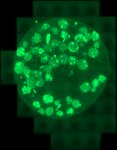

# [v.zanotelli_20190509_p165_031.czi](https://zenodo.org/record/3991919/files/v.zanotelli_20190509_p165_031.czi) report
 - **Autostitch** = true
 - ZeissCZIReader v6.14.0
 - ZeissQuickStartCZIReader v0.1.8-SNAPSHOT

# Images 

| Series            | Quick Start Reader | Size | Original Reader | Size | #Diffs |
|-------------------|--------------------|------|-----------------|------|--------|
| Read time (all)   |34541 ms|------|43994 ms|------|--------|
|0||X:13143 Y:13184 C:2 Z:1 T:1||X:13143 Y:13184 C:2 Z:1 T:1|0|
|1||X:6571 Y:6592 C:2 Z:1 T:1||X:6571 Y:6592 C:2 Z:1 T:1|0|
|2||X:3285 Y:3296 C:2 Z:1 T:1||X:3285 Y:3296 C:2 Z:1 T:1|0|
|3||X:1642 Y:1648 C:2 Z:1 T:1||X:1642 Y:1648 C:2 Z:1 T:1|18006|
|4||X:821 Y:824 C:2 Z:1 T:1||X:821 Y:824 C:2 Z:1 T:1|18020|
|5||X:10306 Y:13156 C:2 Z:1 T:1||X:10306 Y:13156 C:2 Z:1 T:1|0|
|6||X:5153 Y:6578 C:2 Z:1 T:1||X:5153 Y:6578 C:2 Z:1 T:1|0|
|7||X:2576 Y:3289 C:2 Z:1 T:1||X:2576 Y:3289 C:2 Z:1 T:1|0|
|8||X:1288 Y:1644 C:2 Z:1 T:1||X:1288 Y:1644 C:2 Z:1 T:1|14242|
|9||X:644 Y:822 C:2 Z:1 T:1||X:644 Y:822 C:2 Z:1 T:1|14246|
|10||X:11720 Y:13149 C:2 Z:1 T:1||X:11720 Y:13149 C:2 Z:1 T:1|0|
|11||X:5860 Y:6574 C:2 Z:1 T:1||X:5860 Y:6574 C:2 Z:1 T:1|15727|
|12||X:2930 Y:3287 C:2 Z:1 T:1||X:2930 Y:3287 C:2 Z:1 T:1|15849|
|13||X:1465 Y:1643 C:2 Z:1 T:1||X:1465 Y:1643 C:2 Z:1 T:1|15849|
|14||X:732 Y:821 C:2 Z:1 T:1||X:732 Y:821 C:2 Z:1 T:1|15858|
|15||X:541 Y:705 C:3 Z:1 T:1||X:541 Y:705 C:3 Z:1 T:1|0|
|16||X:1585 Y:743 C:3 Z:1 T:1||X:1585 Y:743 C:3 Z:1 T:1|0|

# Metadata

|  Method            | Parameters       | Quick Start Reader | Original Reader | Delta  |
| -------------------|------------------|--------------------|-----------------|------- |
| Initialization     |                  |71 ms|85 ms|        |
| Reader Size (Mb)     |                  |10.07|10.88|        |
| getStageLabelName| Image 0 | ScanRegion0| Scene position #0| |
| getStageLabelX| Image 0 | -34335.125 um | -32465.133 um | 1869.992 um |
| getStageLabelY| Image 0 | 5869.696 um | 7739.688 um | 1869.992 um |
| getStageLabelName| Image 1 | ScanRegion0| Scene position #1| |
| getStageLabelX| Image 1 |  1: null| 2: ome.units.quantity.Length: value[-32465.1328125], unit[µm] stored as java.lang.Double |
| getStageLabelY| Image 1 |  1: null| 2: ome.units.quantity.Length: value[7739.687744140625], unit[µm] stored as java.lang.Double |
| getPixelsPhysicalSizeX| Image 1 | 0.649 um | 0.325 um | 0.325 um |
| getPixelsPhysicalSizeY| Image 1 | 0.649 um | 0.325 um | 0.325 um |
| getStageLabelName| Image 2 | ScanRegion0| Scene position #2| |
| getStageLabelX| Image 2 |  1: null| 2: ome.units.quantity.Length: value[-32465.1328125], unit[µm] stored as java.lang.Double |
| getStageLabelY| Image 2 |  1: null| 2: ome.units.quantity.Length: value[7739.687744140625], unit[µm] stored as java.lang.Double |
| getPixelsPhysicalSizeX| Image 2 | 1.299 um | 0.325 um | 0.974 um |
| getPixelsPhysicalSizeY| Image 2 | 1.299 um | 0.325 um | 0.974 um |
| getStageLabelName| Image 3 | ScanRegion0| Scene position #3| |
| getStageLabelX| Image 3 |  1: null| 2: ome.units.quantity.Length: value[-32465.1328125], unit[µm] stored as java.lang.Double |
| getStageLabelY| Image 3 |  1: null| 2: ome.units.quantity.Length: value[7739.687744140625], unit[µm] stored as java.lang.Double |
| getPixelsPhysicalSizeX| Image 3 | 2.597 um | 0.325 um | 2.273 um |
| getPixelsPhysicalSizeY| Image 3 | 2.597 um | 0.325 um | 2.273 um |
| getStageLabelName| Image 4 | ScanRegion0| Scene position #4| |
| getStageLabelX| Image 4 |  1: null| 2: ome.units.quantity.Length: value[-32465.1328125], unit[µm] stored as java.lang.Double |
| getStageLabelY| Image 4 |  1: null| 2: ome.units.quantity.Length: value[7739.687744140625], unit[µm] stored as java.lang.Double |
| getPixelsPhysicalSizeX| Image 4 | 5.194 um | 0.325 um | 4.870 um |
| getPixelsPhysicalSizeY| Image 4 | 5.194 um | 0.325 um | 4.870 um |
| getStageLabelName| Image 5 | ScanRegion1| Scene position #5| |
| getStageLabelX| Image 5 | -23115.174 um | -21712.681 um | 1402.493 um |
| getStageLabelY| Image 5 | 6804.692 um | 8674.683 um | 1869.991 um |
| getStageLabelName| Image 6 | ScanRegion1| Scene position #6| |
| getStageLabelX| Image 6 |  1: null| 2: ome.units.quantity.Length: value[-21712.6806640625], unit[µm] stored as java.lang.Double |
| getStageLabelY| Image 6 |  1: null| 2: ome.units.quantity.Length: value[8674.683349609375], unit[µm] stored as java.lang.Double |
| getPixelsPhysicalSizeX| Image 6 | 0.649 um | 0.325 um | 0.325 um |
| getPixelsPhysicalSizeY| Image 6 | 0.649 um | 0.325 um | 0.325 um |
| getStageLabelName| Image 7 | ScanRegion1| Scene position #7| |
| getStageLabelX| Image 7 |  1: null| 2: ome.units.quantity.Length: value[-21712.6806640625], unit[µm] stored as java.lang.Double |
| getStageLabelY| Image 7 |  1: null| 2: ome.units.quantity.Length: value[8674.683349609375], unit[µm] stored as java.lang.Double |
| getPixelsPhysicalSizeX| Image 7 | 1.299 um | 0.325 um | 0.974 um |
| getPixelsPhysicalSizeY| Image 7 | 1.299 um | 0.325 um | 0.974 um |
| getStageLabelName| Image 8 | ScanRegion1| Scene position #8| |
| getStageLabelX| Image 8 |  1: null| 2: ome.units.quantity.Length: value[-21712.6806640625], unit[µm] stored as java.lang.Double |
| getStageLabelY| Image 8 |  1: null| 2: ome.units.quantity.Length: value[8674.683349609375], unit[µm] stored as java.lang.Double |
| getPixelsPhysicalSizeX| Image 8 | 2.597 um | 0.325 um | 2.273 um |
| getPixelsPhysicalSizeY| Image 8 | 2.597 um | 0.325 um | 2.273 um |
| getStageLabelName| Image 9 | ScanRegion1| Scene position #9| |
| getStageLabelX| Image 9 |  1: null| 2: ome.units.quantity.Length: value[-21712.6806640625], unit[µm] stored as java.lang.Double |
| getStageLabelY| Image 9 |  1: null| 2: ome.units.quantity.Length: value[8674.683349609375], unit[µm] stored as java.lang.Double |
| getPixelsPhysicalSizeX| Image 9 | 5.194 um | 0.325 um | 4.870 um |
| getPixelsPhysicalSizeY| Image 9 | 5.194 um | 0.325 um | 4.870 um |
| getStageLabelName| Image 10 | ScanRegion2| Scene position #10| |
| getStageLabelX| Image 10 | -41347.594 um | -39711.350 um | 1636.244 um |
| getStageLabelY| Image 10 | 11479.671 um | 13349.663 um | 1869.992 um |
| getStageLabelZ| Image 10 | 4159.811 um | 4161.548 um | 1.737 um |
| getStageLabelName| Image 11 | ScanRegion2| Scene position #11| |
| getStageLabelX| Image 11 |  1: null| 2: ome.units.quantity.Length: value[-39711.349609375], unit[µm] stored as java.lang.Double |
| getStageLabelY| Image 11 |  1: null| 2: ome.units.quantity.Length: value[13349.66259765625], unit[µm] stored as java.lang.Double |
| getPixelsPhysicalSizeX| Image 11 | 0.649 um | 0.325 um | 0.325 um |
| getPixelsPhysicalSizeY| Image 11 | 0.649 um | 0.325 um | 0.325 um |
| getStageLabelName| Image 12 | ScanRegion2| Scene position #12| |
| getStageLabelX| Image 12 |  1: null| 2: ome.units.quantity.Length: value[-39711.349609375], unit[µm] stored as java.lang.Double |
| getStageLabelY| Image 12 |  1: null| 2: ome.units.quantity.Length: value[13349.66259765625], unit[µm] stored as java.lang.Double |
| getPixelsPhysicalSizeX| Image 12 | 1.299 um | 0.325 um | 0.974 um |
| getPixelsPhysicalSizeY| Image 12 | 1.299 um | 0.325 um | 0.974 um |
| getStageLabelName| Image 13 | ScanRegion2| Scene position #13| |
| getStageLabelX| Image 13 |  1: null| 2: ome.units.quantity.Length: value[-39711.349609375], unit[µm] stored as java.lang.Double |
| getStageLabelY| Image 13 |  1: null| 2: ome.units.quantity.Length: value[13349.66259765625], unit[µm] stored as java.lang.Double |
| getPixelsPhysicalSizeX| Image 13 | 2.597 um | 0.325 um | 2.273 um |
| getPixelsPhysicalSizeY| Image 13 | 2.597 um | 0.325 um | 2.273 um |
| getStageLabelName| Image 14 | ScanRegion2| Scene position #14| |
| getStageLabelX| Image 14 |  1: null| 2: ome.units.quantity.Length: value[-39711.349609375], unit[µm] stored as java.lang.Double |
| getStageLabelY| Image 14 |  1: null| 2: ome.units.quantity.Length: value[13349.66259765625], unit[µm] stored as java.lang.Double |
| getPixelsPhysicalSizeX| Image 14 | 5.194 um | 0.325 um | 4.870 um |
| getPixelsPhysicalSizeY| Image 14 | 5.194 um | 0.325 um | 4.870 um |
| getImageAcquisitionDate| Image 15 |  1: null| 2: 2019-05-09T15:07:09.494 |
| getPixelsPhysicalSizeX| Image 15 |  1: null| 2: ome.units.quantity.Length: value[0.32465132447751116], unit[µm] stored as java.lang.Double |
| getPixelsPhysicalSizeY| Image 15 |  1: null| 2: ome.units.quantity.Length: value[0.32465132447751116], unit[µm] stored as java.lang.Double |
| getImageAcquisitionDate| Image 16 |  1: null| 2: 2019-05-09T15:07:09.494 |
| getPixelsPhysicalSizeX| Image 16 |  1: null| 2: ome.units.quantity.Length: value[0.32465132447751116], unit[µm] stored as java.lang.Double |
| getPixelsPhysicalSizeY| Image 16 |  1: null| 2: ome.units.quantity.Length: value[0.32465132447751116], unit[µm] stored as java.lang.Double |
| getPlanePositionX| Image 0 Plane 0 | -34335.125 um | -32465.133 um | 1869.992 um |
| getPlanePositionY| Image 0 Plane 0 | 5869.696 um | 7739.688 um | 1869.992 um |
| getPlanePositionX| Image 0 Plane 1 | -34335.125 um | -32465.133 um | 1869.992 um |
| getPlanePositionY| Image 0 Plane 1 | 5869.696 um | 7739.688 um | 1869.992 um |
| getPlaneDeltaT| Image 1 Plane 0 |  1: null| 2: ome.units.quantity.Time: value[2.6381509], unit[s] stored as java.lang.Double |
| getPlaneExposureTime| Image 1 Plane 0 |  1: null| 2: ome.units.quantity.Time: value[150.0], unit[s] stored as java.lang.Double |
| getPlanePositionX| Image 1 Plane 0 |  1: null| 2: ome.units.quantity.Length: value[-32465.1328125], unit[µm] stored as java.lang.Double |
| getPlanePositionY| Image 1 Plane 0 |  1: null| 2: ome.units.quantity.Length: value[7739.687744140625], unit[µm] stored as java.lang.Double |
| getPlaneDeltaT| Image 1 Plane 1 |  1: null| 2: ome.units.quantity.Time: value[2.6381509], unit[s] stored as java.lang.Double |
| getPlaneExposureTime| Image 1 Plane 1 |  1: null| 2: ome.units.quantity.Time: value[10.0], unit[s] stored as java.lang.Double |
| getPlanePositionX| Image 1 Plane 1 |  1: null| 2: ome.units.quantity.Length: value[-32465.1328125], unit[µm] stored as java.lang.Double |
| getPlanePositionY| Image 1 Plane 1 |  1: null| 2: ome.units.quantity.Length: value[7739.687744140625], unit[µm] stored as java.lang.Double |
| getPlaneDeltaT| Image 2 Plane 0 |  1: null| 2: ome.units.quantity.Time: value[2.6381509], unit[s] stored as java.lang.Double |
| getPlaneExposureTime| Image 2 Plane 0 |  1: null| 2: ome.units.quantity.Time: value[150.0], unit[s] stored as java.lang.Double |
| getPlanePositionX| Image 2 Plane 0 |  1: null| 2: ome.units.quantity.Length: value[-32465.1328125], unit[µm] stored as java.lang.Double |
| getPlanePositionY| Image 2 Plane 0 |  1: null| 2: ome.units.quantity.Length: value[7739.687744140625], unit[µm] stored as java.lang.Double |
| getPlaneDeltaT| Image 2 Plane 1 |  1: null| 2: ome.units.quantity.Time: value[2.6381509], unit[s] stored as java.lang.Double |
| getPlaneExposureTime| Image 2 Plane 1 |  1: null| 2: ome.units.quantity.Time: value[10.0], unit[s] stored as java.lang.Double |
| getPlanePositionX| Image 2 Plane 1 |  1: null| 2: ome.units.quantity.Length: value[-32465.1328125], unit[µm] stored as java.lang.Double |
| getPlanePositionY| Image 2 Plane 1 |  1: null| 2: ome.units.quantity.Length: value[7739.687744140625], unit[µm] stored as java.lang.Double |
| getPlaneDeltaT| Image 3 Plane 0 |  1: null| 2: ome.units.quantity.Time: value[2.6381509], unit[s] stored as java.lang.Double |
| getPlaneExposureTime| Image 3 Plane 0 |  1: null| 2: ome.units.quantity.Time: value[150.0], unit[s] stored as java.lang.Double |
| getPlanePositionX| Image 3 Plane 0 |  1: null| 2: ome.units.quantity.Length: value[-32465.1328125], unit[µm] stored as java.lang.Double |
| getPlanePositionY| Image 3 Plane 0 |  1: null| 2: ome.units.quantity.Length: value[7739.687744140625], unit[µm] stored as java.lang.Double |
| getPlaneDeltaT| Image 3 Plane 1 |  1: null| 2: ome.units.quantity.Time: value[2.6381509], unit[s] stored as java.lang.Double |
| getPlaneExposureTime| Image 3 Plane 1 |  1: null| 2: ome.units.quantity.Time: value[10.0], unit[s] stored as java.lang.Double |
| getPlanePositionX| Image 3 Plane 1 |  1: null| 2: ome.units.quantity.Length: value[-32465.1328125], unit[µm] stored as java.lang.Double |
| getPlanePositionY| Image 3 Plane 1 |  1: null| 2: ome.units.quantity.Length: value[7739.687744140625], unit[µm] stored as java.lang.Double |
| getPlaneDeltaT| Image 4 Plane 0 |  1: null| 2: ome.units.quantity.Time: value[2.6381509], unit[s] stored as java.lang.Double |
| getPlaneExposureTime| Image 4 Plane 0 |  1: null| 2: ome.units.quantity.Time: value[150.0], unit[s] stored as java.lang.Double |
| getPlanePositionX| Image 4 Plane 0 |  1: null| 2: ome.units.quantity.Length: value[-32465.1328125], unit[µm] stored as java.lang.Double |
| getPlanePositionY| Image 4 Plane 0 |  1: null| 2: ome.units.quantity.Length: value[7739.687744140625], unit[µm] stored as java.lang.Double |
| getPlaneDeltaT| Image 4 Plane 1 |  1: null| 2: ome.units.quantity.Time: value[2.6381509], unit[s] stored as java.lang.Double |
| getPlaneExposureTime| Image 4 Plane 1 |  1: null| 2: ome.units.quantity.Time: value[10.0], unit[s] stored as java.lang.Double |
| getPlanePositionX| Image 4 Plane 1 |  1: null| 2: ome.units.quantity.Length: value[-32465.1328125], unit[µm] stored as java.lang.Double |
| getPlanePositionY| Image 4 Plane 1 |  1: null| 2: ome.units.quantity.Length: value[7739.687744140625], unit[µm] stored as java.lang.Double |
| getPlanePositionX| Image 5 Plane 0 | -23115.174 um | -21712.681 um | 1402.493 um |
| getPlanePositionY| Image 5 Plane 0 | 6804.692 um | 8674.683 um | 1869.991 um |
| getPlanePositionX| Image 5 Plane 1 | -23115.174 um | -21712.681 um | 1402.493 um |
| getPlanePositionY| Image 5 Plane 1 | 6804.692 um | 8674.683 um | 1869.991 um |
| getPlaneDeltaT| Image 6 Plane 0 |  1: null| 2: ome.units.quantity.Time: value[2.6381509], unit[s] stored as java.lang.Double |
| getPlaneExposureTime| Image 6 Plane 0 |  1: null| 2: ome.units.quantity.Time: value[150.0], unit[s] stored as java.lang.Double |
| getPlanePositionX| Image 6 Plane 0 |  1: null| 2: ome.units.quantity.Length: value[-21712.6806640625], unit[µm] stored as java.lang.Double |
| getPlanePositionY| Image 6 Plane 0 |  1: null| 2: ome.units.quantity.Length: value[8674.683349609375], unit[µm] stored as java.lang.Double |
| getPlaneDeltaT| Image 6 Plane 1 |  1: null| 2: ome.units.quantity.Time: value[2.6381509], unit[s] stored as java.lang.Double |
| getPlaneExposureTime| Image 6 Plane 1 |  1: null| 2: ome.units.quantity.Time: value[10.0], unit[s] stored as java.lang.Double |
| getPlanePositionX| Image 6 Plane 1 |  1: null| 2: ome.units.quantity.Length: value[-21712.6806640625], unit[µm] stored as java.lang.Double |
| getPlanePositionY| Image 6 Plane 1 |  1: null| 2: ome.units.quantity.Length: value[8674.683349609375], unit[µm] stored as java.lang.Double |
| getPlaneDeltaT| Image 7 Plane 0 |  1: null| 2: ome.units.quantity.Time: value[2.6381509], unit[s] stored as java.lang.Double |
| getPlaneExposureTime| Image 7 Plane 0 |  1: null| 2: ome.units.quantity.Time: value[150.0], unit[s] stored as java.lang.Double |
| getPlanePositionX| Image 7 Plane 0 |  1: null| 2: ome.units.quantity.Length: value[-21712.6806640625], unit[µm] stored as java.lang.Double |
| getPlanePositionY| Image 7 Plane 0 |  1: null| 2: ome.units.quantity.Length: value[8674.683349609375], unit[µm] stored as java.lang.Double |
| getPlaneDeltaT| Image 7 Plane 1 |  1: null| 2: ome.units.quantity.Time: value[2.6381509], unit[s] stored as java.lang.Double |
| getPlaneExposureTime| Image 7 Plane 1 |  1: null| 2: ome.units.quantity.Time: value[10.0], unit[s] stored as java.lang.Double |
| getPlanePositionX| Image 7 Plane 1 |  1: null| 2: ome.units.quantity.Length: value[-21712.6806640625], unit[µm] stored as java.lang.Double |
| getPlanePositionY| Image 7 Plane 1 |  1: null| 2: ome.units.quantity.Length: value[8674.683349609375], unit[µm] stored as java.lang.Double |
| getPlaneDeltaT| Image 8 Plane 0 |  1: null| 2: ome.units.quantity.Time: value[2.6381509], unit[s] stored as java.lang.Double |
| getPlaneExposureTime| Image 8 Plane 0 |  1: null| 2: ome.units.quantity.Time: value[150.0], unit[s] stored as java.lang.Double |
| getPlanePositionX| Image 8 Plane 0 |  1: null| 2: ome.units.quantity.Length: value[-21712.6806640625], unit[µm] stored as java.lang.Double |
| getPlanePositionY| Image 8 Plane 0 |  1: null| 2: ome.units.quantity.Length: value[8674.683349609375], unit[µm] stored as java.lang.Double |
| getPlaneDeltaT| Image 8 Plane 1 |  1: null| 2: ome.units.quantity.Time: value[2.6381509], unit[s] stored as java.lang.Double |
| getPlaneExposureTime| Image 8 Plane 1 |  1: null| 2: ome.units.quantity.Time: value[10.0], unit[s] stored as java.lang.Double |
| getPlanePositionX| Image 8 Plane 1 |  1: null| 2: ome.units.quantity.Length: value[-21712.6806640625], unit[µm] stored as java.lang.Double |
| getPlanePositionY| Image 8 Plane 1 |  1: null| 2: ome.units.quantity.Length: value[8674.683349609375], unit[µm] stored as java.lang.Double |
| getPlaneDeltaT| Image 9 Plane 0 |  1: null| 2: ome.units.quantity.Time: value[2.6381509], unit[s] stored as java.lang.Double |
| getPlaneExposureTime| Image 9 Plane 0 |  1: null| 2: ome.units.quantity.Time: value[150.0], unit[s] stored as java.lang.Double |
| getPlanePositionX| Image 9 Plane 0 |  1: null| 2: ome.units.quantity.Length: value[-21712.6806640625], unit[µm] stored as java.lang.Double |
| getPlanePositionY| Image 9 Plane 0 |  1: null| 2: ome.units.quantity.Length: value[8674.683349609375], unit[µm] stored as java.lang.Double |
| getPlaneDeltaT| Image 9 Plane 1 |  1: null| 2: ome.units.quantity.Time: value[2.6381509], unit[s] stored as java.lang.Double |
| getPlaneExposureTime| Image 9 Plane 1 |  1: null| 2: ome.units.quantity.Time: value[10.0], unit[s] stored as java.lang.Double |
| getPlanePositionX| Image 9 Plane 1 |  1: null| 2: ome.units.quantity.Length: value[-21712.6806640625], unit[µm] stored as java.lang.Double |
| getPlanePositionY| Image 9 Plane 1 |  1: null| 2: ome.units.quantity.Length: value[8674.683349609375], unit[µm] stored as java.lang.Double |
| getPlanePositionX| Image 10 Plane 0 | -41347.594 um | -39711.350 um | 1636.244 um |
| getPlanePositionY| Image 10 Plane 0 | 11479.671 um | 13349.663 um | 1869.992 um |
| getPlanePositionZ| Image 10 Plane 0 | 4159.811 um | 4161.548 um | 1.737 um |
| getPlanePositionX| Image 10 Plane 1 | -41347.594 um | -39711.350 um | 1636.244 um |
| getPlanePositionY| Image 10 Plane 1 | 11479.671 um | 13349.663 um | 1869.992 um |
| getPlanePositionZ| Image 10 Plane 1 | 4159.811 um | 4161.548 um | 1.737 um |
| getPlaneDeltaT| Image 11 Plane 0 |  1: null| 2: ome.units.quantity.Time: value[2.6381509], unit[s] stored as java.lang.Double |
| getPlaneExposureTime| Image 11 Plane 0 |  1: null| 2: ome.units.quantity.Time: value[150.0], unit[s] stored as java.lang.Double |
| getPlanePositionX| Image 11 Plane 0 |  1: null| 2: ome.units.quantity.Length: value[-39711.349609375], unit[µm] stored as java.lang.Double |
| getPlanePositionY| Image 11 Plane 0 |  1: null| 2: ome.units.quantity.Length: value[13349.66259765625], unit[µm] stored as java.lang.Double |
| getPlaneDeltaT| Image 11 Plane 1 |  1: null| 2: ome.units.quantity.Time: value[2.6381509], unit[s] stored as java.lang.Double |
| getPlaneExposureTime| Image 11 Plane 1 |  1: null| 2: ome.units.quantity.Time: value[10.0], unit[s] stored as java.lang.Double |
| getPlanePositionX| Image 11 Plane 1 |  1: null| 2: ome.units.quantity.Length: value[-39711.349609375], unit[µm] stored as java.lang.Double |
| getPlanePositionY| Image 11 Plane 1 |  1: null| 2: ome.units.quantity.Length: value[13349.66259765625], unit[µm] stored as java.lang.Double |
| getPlaneDeltaT| Image 12 Plane 0 |  1: null| 2: ome.units.quantity.Time: value[2.6381509], unit[s] stored as java.lang.Double |
| getPlaneExposureTime| Image 12 Plane 0 |  1: null| 2: ome.units.quantity.Time: value[150.0], unit[s] stored as java.lang.Double |
| getPlanePositionX| Image 12 Plane 0 |  1: null| 2: ome.units.quantity.Length: value[-39711.349609375], unit[µm] stored as java.lang.Double |
| getPlanePositionY| Image 12 Plane 0 |  1: null| 2: ome.units.quantity.Length: value[13349.66259765625], unit[µm] stored as java.lang.Double |
| getPlaneDeltaT| Image 12 Plane 1 |  1: null| 2: ome.units.quantity.Time: value[2.6381509], unit[s] stored as java.lang.Double |
| getPlaneExposureTime| Image 12 Plane 1 |  1: null| 2: ome.units.quantity.Time: value[10.0], unit[s] stored as java.lang.Double |
| getPlanePositionX| Image 12 Plane 1 |  1: null| 2: ome.units.quantity.Length: value[-39711.349609375], unit[µm] stored as java.lang.Double |
| getPlanePositionY| Image 12 Plane 1 |  1: null| 2: ome.units.quantity.Length: value[13349.66259765625], unit[µm] stored as java.lang.Double |
| getPlaneDeltaT| Image 13 Plane 0 |  1: null| 2: ome.units.quantity.Time: value[2.6381509], unit[s] stored as java.lang.Double |
| getPlaneExposureTime| Image 13 Plane 0 |  1: null| 2: ome.units.quantity.Time: value[150.0], unit[s] stored as java.lang.Double |
| getPlanePositionX| Image 13 Plane 0 |  1: null| 2: ome.units.quantity.Length: value[-39711.349609375], unit[µm] stored as java.lang.Double |
| getPlanePositionY| Image 13 Plane 0 |  1: null| 2: ome.units.quantity.Length: value[13349.66259765625], unit[µm] stored as java.lang.Double |
| getPlaneDeltaT| Image 13 Plane 1 |  1: null| 2: ome.units.quantity.Time: value[2.6381509], unit[s] stored as java.lang.Double |
| getPlaneExposureTime| Image 13 Plane 1 |  1: null| 2: ome.units.quantity.Time: value[10.0], unit[s] stored as java.lang.Double |
| getPlanePositionX| Image 13 Plane 1 |  1: null| 2: ome.units.quantity.Length: value[-39711.349609375], unit[µm] stored as java.lang.Double |
| getPlanePositionY| Image 13 Plane 1 |  1: null| 2: ome.units.quantity.Length: value[13349.66259765625], unit[µm] stored as java.lang.Double |
| getPlaneDeltaT| Image 14 Plane 0 |  1: null| 2: ome.units.quantity.Time: value[2.6381509], unit[s] stored as java.lang.Double |
| getPlaneExposureTime| Image 14 Plane 0 |  1: null| 2: ome.units.quantity.Time: value[150.0], unit[s] stored as java.lang.Double |
| getPlanePositionX| Image 14 Plane 0 |  1: null| 2: ome.units.quantity.Length: value[-39711.349609375], unit[µm] stored as java.lang.Double |
| getPlanePositionY| Image 14 Plane 0 |  1: null| 2: ome.units.quantity.Length: value[13349.66259765625], unit[µm] stored as java.lang.Double |
| getPlaneDeltaT| Image 14 Plane 1 |  1: null| 2: ome.units.quantity.Time: value[2.6381509], unit[s] stored as java.lang.Double |
| getPlaneExposureTime| Image 14 Plane 1 |  1: null| 2: ome.units.quantity.Time: value[10.0], unit[s] stored as java.lang.Double |
| getPlanePositionX| Image 14 Plane 1 |  1: null| 2: ome.units.quantity.Length: value[-39711.349609375], unit[µm] stored as java.lang.Double |
| getPlanePositionY| Image 14 Plane 1 |  1: null| 2: ome.units.quantity.Length: value[13349.66259765625], unit[µm] stored as java.lang.Double |
