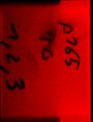

# [v.zanotelli_20190509_p165_031_pt1.czi](https://zenodo.org/record/3991919/files/v.zanotelli_20190509_p165_031_pt1.czi) report
 - **Autostitch** = true
 - ZeissCZIReader v6.14.0
 - ZeissQuickStartCZIReader v0.1.8-SNAPSHOT

# Images 

| Series            | Quick Start Reader | Size | Original Reader | Size | #Diffs |
|-------------------|--------------------|------|-----------------|------|--------|
| Read time (all)   |48 ms|------|57 ms|------|--------|
|0||X:541 Y:705 C:3 Z:1 T:1||X:541 Y:705 C:3 Z:1 T:1|0|

# Metadata

|  Method            | Parameters       | Quick Start Reader | Original Reader | Delta  |
| -------------------|------------------|--------------------|-----------------|------- |
| Initialization     |                  |8 ms|11 ms|        |
| Reader Size (Mb)     |                  |0.85|1.03|        |
