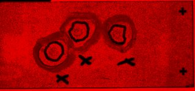

# [v.zanotelli_20190509_p165_031_pt2.czi](https://zenodo.org/record/3991919/files/v.zanotelli_20190509_p165_031_pt2.czi) report
 - **Autostitch** = true
 - ZeissCZIReader v6.13.0
 - ZeissQuickStartCZIReader v0.1.4-SNAPSHOT

# Images 

| Series            | Quick Start Reader | Size | Original Reader | Size |
|-------------------|--------------------|------|-----------------|------|
| Read time (all)   |115 ms|------|130 ms|------|
|0||X:1585 Y:743 C:3 Z:1 T:1||X:1585 Y:743 C:3 Z:1 T:1|

# Metadata

|  Method            | Parameters       | Quick Start Reader | Original Reader | Delta  |
| -------------------|------------------|--------------------|-----------------|------- |
| Initialization     |                  |9 ms|12 ms|        |
| getStageLabelX| Image 0 | ome.units.quantity.Length: value[0.0], unit[µm] stored as java.lang.Double| ome.units.quantity.Length: value[0], unit[reference frame] stored as java.lang.Integer| |
| getStageLabelY| Image 0 | ome.units.quantity.Length: value[0.0], unit[µm] stored as java.lang.Double| ome.units.quantity.Length: value[0], unit[reference frame] stored as java.lang.Integer| |
| getPlaneDeltaT| Image 0 Plane 0 | | 1: ome.units.quantity.Time: value[-1.557400040299E9], unit[s] stored as java.lang.Double| 2: null |
| getPlanePositionX| Image 0 Plane 0 | ome.units.quantity.Length: value[0.0], unit[µm] stored as java.lang.Double| ome.units.quantity.Length: value[0], unit[reference frame] stored as java.lang.Integer| |
| getPlanePositionY| Image 0 Plane 0 | ome.units.quantity.Length: value[0.0], unit[µm] stored as java.lang.Double| ome.units.quantity.Length: value[0], unit[reference frame] stored as java.lang.Integer| |
| getPlanePositionZ| Image 0 Plane 0 | | 1: ome.units.quantity.Length: value[0.0], unit[µm] stored as java.lang.Double| 2: null |
