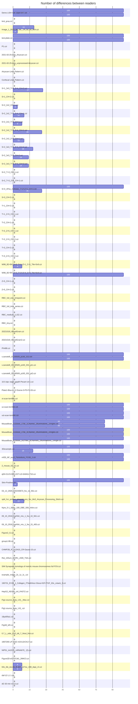
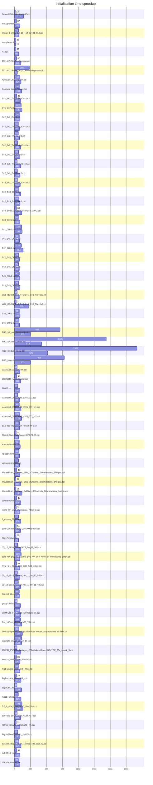
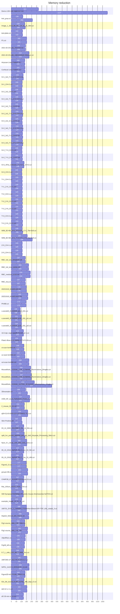
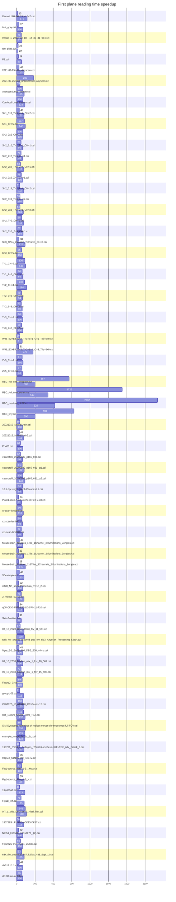

## Number of differences between readers (cropped to 100)

```mermaid
        gantt
            title Number of differences between readers
            dateFormat  X
            axisFormat %s

            section Demo LISH 4x8 15pct 647.czi
            100   : 0, 100
            section Demo LISH 4x8 15pct 647.czi
            100   : 0, 100
            section test_gray.czi
            0   : 0, 0
            section test_gray.czi
            0   : 0, 0
            section Image_1_2023_08_18__14_32_31_964.czi
            19   : 0, 19
            section Image_1_2023_08_18__14_32_31_964.czi
            4   : 0, 4
            section test-plate.czi
            100   : 0, 100
            section test-plate.czi
            100   : 0, 100
            section P1.czi
            0   : 0, 0
            section P1.czi
            0   : 0, 0
            section 2021-02-25-tulip_Airyscan.czi
            0   : 0, 0
            section 2021-02-25-tulip_Airyscan.czi
            0   : 0, 0
            section 2021-02-25-tulip_unprocessed-Airyscan.czi
            0   : 0, 0
            section 2021-02-25-tulip_unprocessed-Airyscan.czi
            0   : 0, 0
            section Airyscan Lines Pattern.czi
            0   : 0, 0
            section Airyscan Lines Pattern.czi
            0   : 0, 0
            section Confocal Lines Pattern.czi
            0   : 0, 0
            section Confocal Lines Pattern.czi
            0   : 0, 0
            section S=1_3x3_T=3_Z=4_CH=2.czi
            0   : 0, 0
            section S=1_3x3_T=3_Z=4_CH=2.czi
            27   : 0, 27
            section S=1_CH=2.czi
            0   : 0, 0
            section S=1_CH=2.czi
            0   : 0, 0
            section S=2_2x2_CH=1.czi
            0   : 0, 0
            section S=2_2x2_CH=1.czi
            4   : 0, 4
            section S=2_2x2_T=1_Z=4_CH=1.czi
            0   : 0, 0
            section S=2_2x2_T=1_Z=4_CH=1.czi
            10   : 0, 10
            section S=2_2x2_T=3_CH=1.czi
            0   : 0, 0
            section S=2_2x2_T=3_CH=1.czi
            8   : 0, 8
            section S=2_2x2_T=3_Z=4_CH=1.czi
            0   : 0, 0
            section S=2_2x2_T=3_Z=4_CH=1.czi
            26   : 0, 26
            section S=2_2x2_Z=4_CH=1.czi
            0   : 0, 0
            section S=2_2x2_Z=4_CH=1.czi
            10   : 0, 10
            section S=2_3x3_T=1_Z=4_CH=2.czi
            0   : 0, 0
            section S=2_3x3_T=1_Z=4_CH=2.czi
            18   : 0, 18
            section S=2_3x3_T=3_CH=2.czi
            0   : 0, 0
            section S=2_3x3_T=3_CH=2.czi
            14   : 0, 14
            section S=2_3x3_T=3_Z=1_CH=2.czi
            0   : 0, 0
            section S=2_3x3_T=3_Z=1_CH=2.czi
            14   : 0, 14
            section S=2_T=3_CH=1.czi
            0   : 0, 0
            section S=2_T=3_CH=1.czi
            0   : 0, 0
            section S=2_T=3_Z=5_CH=1.czi
            0   : 0, 0
            section S=2_T=3_Z=5_CH=1.czi
            0   : 0, 0
            section S=3_1Pos_2Mosaic_T=2=Z=3_CH=2.czi
            100   : 0, 100
            section S=3_1Pos_2Mosaic_T=2=Z=3_CH=2.czi
            26   : 0, 26
            section S=3_CH=2.czi
            0   : 0, 0
            section S=3_CH=2.czi
            0   : 0, 0
            section T=1_CH=2.czi
            0   : 0, 0
            section T=1_CH=2.czi
            0   : 0, 0
            section T=1_Z=5_CH=1.czi
            0   : 0, 0
            section T=1_Z=5_CH=1.czi
            0   : 0, 0
            section T=2_CH=1.czi
            0   : 0, 0
            section T=2_CH=1.czi
            0   : 0, 0
            section T=2_Z=5_CH=1.czi
            0   : 0, 0
            section T=2_Z=5_CH=1.czi
            0   : 0, 0
            section T=2_Z=5_CH=2.czi
            0   : 0, 0
            section T=2_Z=5_CH=2.czi
            0   : 0, 0
            section T=3_CH=2.czi
            0   : 0, 0
            section T=3_CH=2.czi
            0   : 0, 0
            section T=3_Z=5_CH=2.czi
            0   : 0, 0
            section T=3_Z=5_CH=2.czi
            0   : 0, 0
            section W96_B2+B4_S=2_T=1=Z=1_C=1_Tile=5x9.czi
            0   : 0, 0
            section W96_B2+B4_S=2_T=1=Z=1_C=1_Tile=5x9.czi
            8   : 0, 8
            section W96_B2+B4_S=2_T=2=Z=4_C=3_Tile=5x9.czi
            0   : 0, 0
            section W96_B2+B4_S=2_T=2=Z=4_C=3_Tile=5x9.czi
            100   : 0, 100
            section Z=5_CH=1.czi
            0   : 0, 0
            section Z=5_CH=1.czi
            0   : 0, 0
            section Z=5_CH=2.czi
            0   : 0, 0
            section Z=5_CH=2.czi
            0   : 0, 0
            section RBC_full_one_timepoint.czi
            0   : 0, 0
            section RBC_full_one_timepoint.czi
            0   : 0, 0
            section RBC_full_time_series.czi
            0   : 0, 0
            section RBC_full_time_series.czi
            0   : 0, 0
            section RBC_medium_LLSZ.czi
            0   : 0, 0
            section RBC_medium_LLSZ.czi
            0   : 0, 0
            section RBC_tiny.czi
            0   : 0, 0
            section RBC_tiny.czi
            0   : 0, 0
            section 20221019_MixedGrain.czi
            0   : 0, 0
            section 20221019_MixedGrain.czi
            0   : 0, 0
            section 20221019_MixedGrain2.czi
            0   : 0, 0
            section 20221019_MixedGrain2.czi
            0   : 0, 0
            section Ph488.czi
            0   : 0, 0
            section Ph488.czi
            0   : 0, 0
            section v.zanotelli_20190509_p165_031.czi
            100   : 0, 100
            section v.zanotelli_20190509_p165_031.czi
            100   : 0, 100
            section v.zanotelli_20190509_p165_031_pt1.czi
            0   : 0, 0
            section v.zanotelli_20190509_p165_031_pt1.czi
            0   : 0, 0
            section v.zanotelli_20190509_p165_031_pt2.czi
            0   : 0, 0
            section v.zanotelli_20190509_p165_031_pt2.czi
            0   : 0, 0
            section 10.5 dpc vegfc gapdh Pecam wt 1.czi
            0   : 0, 0
            section 10.5 dpc vegfc gapdh Pecam wt 1.czi
            0   : 0, 0
            section Plate1-Blue-A-12-Scene-3-P3-F2-03.czi
            0   : 0, 0
            section Plate1-Blue-A-12-Scene-3-P3-F2-03.czi
            0   : 0, 0
            section xt-scan-lsm980.czi
            0   : 0, 0
            section xt-scan-lsm980.czi
            0   : 0, 0
            section xz-scan-lsm980.czi
            100   : 0, 100
            section xz-scan-lsm980.czi
            100   : 0, 100
            section xzt-scan-lsm980.czi
            100   : 0, 100
            section xzt-scan-lsm980.czi
            100   : 0, 100
            section MouseBrain_41Slices_1Tile_1Channel_2Illuminations_2Angles.czi
            83   : 0, 83
            section MouseBrain_41Slices_1Tile_1Channel_2Illuminations_2Angles.czi
            83   : 0, 83
            section MouseBrain_41Slices_1Tile_3Channel_2Illuminations_2Angles.czi
            100   : 0, 100
            section MouseBrain_41Slices_1Tile_3Channel_2Illuminations_2Angles.czi
            100   : 0, 100
            section MouseBrain_41Slices_2x2Tiles_3Channels_2Illuminations_1Angle.czi
            100   : 0, 100
            section MouseBrain_41Slices_2x2Tiles_3Channels_2Illuminations_1Angle.czi
            0   : 0, 0
            section 3Dexample.czi
            100   : 0, 100
            section 3Dexample.czi
            18   : 0, 18
            section mf20_NF_sox9_Paroedura_PO18_2.czi
            100   : 0, 100
            section mf20_NF_sox9_Paroedura_PO18_2.czi
            100   : 0, 100
            section 2_mouse_02_01.czi
            0   : 0, 0
            section 2_mouse_02_01.czi
            0   : 0, 0
            section qDII-CLV3-DR5-E27-LD-SAM11-T10.czi
            0   : 0, 0
            section qDII-CLV3-DR5-E27-LD-SAM11-T10.czi
            0   : 0, 0
            section Skin-Positive.czi
            100   : 0, 100
            section Skin-Positive.czi
            4   : 0, 4
            section 03_12_2020_DSGN0673_fov_11_561.czi
            0   : 0, 0
            section 03_12_2020_DSGN0673_fov_11_561.czi
            0   : 0, 0
            section split_hcr_probes_plasmid_pos_fov_tile3_Airyscan_Processing_Stitch.czi
            0   : 0, 0
            section split_hcr_probes_plasmid_pos_fov_tile3_Airyscan_Processing_Stitch.czi
            10   : 0, 10
            section Nyre_5-1_Strep_100_DBE_500_mikro.czi
            0   : 0, 0
            section Nyre_5-1_Strep_100_DBE_500_mikro.czi
            0   : 0, 0
            section 09_10_2018_hiprfish_mix_1_fov_10_561.czi
            0   : 0, 0
            section 09_10_2018_hiprfish_mix_1_fov_10_561.czi
            0   : 0, 0
            section 09_10_2018_hiprfish_mix_1_fov_15_405.czi
            0   : 0, 0
            section 09_10_2018_hiprfish_mix_1_fov_15_405.czi
            0   : 0, 0
            section Figure2_G.czi
            0   : 0, 0
            section Figure2_G.czi
            0   : 0, 0
            section group1-08.czi
            0   : 0, 0
            section group1-08.czi
            0   : 0, 0
            section CHMP2B_IF_A13410_CR-Gauss-15.czi
            0   : 0, 0
            section CHMP2B_IF_A13410_CR-Gauss-15.czi
            0   : 0, 0
            section Rat_100um_MOR1_x500_TSA.czi
            0   : 0, 0
            section Rat_100um_MOR1_x500_TSA.czi
            0   : 0, 0
            section SIM Synapsed homologs of meiotic mouse chromosomes full FOV.czi
            0   : 0, 0
            section SIM Synapsed homologs of meiotic mouse chromosomes full FOV.czi
            0   : 0, 0
            section example_image_2c_1z_1t_.czi
            0   : 0, 0
            section example_image_2c_1z_1t_.czi
            0   : 0, 0
            section 190731_EV38_1_Collagen_ITSwithAsc+Dexa+IGF+TGF_63x_zstack_3.czi
            0   : 0, 0
            section 190731_EV38_1_Collagen_ITSwithAsc+Dexa+IGF+TGF_63x_zstack_3.czi
            0   : 0, 0
            section HepG2_ND100_ctrl_FASTZ.czi
            0   : 0, 0
            section HepG2_ND100_ctrl_FASTZ.czi
            0   : 0, 0
            section Fig1-source_data_1-B__Max.czi
            0   : 0, 0
            section Fig1-source_data_1-B__Max.czi
            0   : 0, 0
            section Fig1-source_data_1-B_.czi
            0   : 0, 0
            section Fig1-source_data_1-B_.czi
            0   : 0, 0
            section 19juil05a1.czi
            0   : 0, 0
            section 19juil05a1.czi
            0   : 0, 0
            section Fig1B_left.czi
            0   : 0, 0
            section Fig1B_left.czi
            0   : 0, 0
            section 0.7_L_side_LSO_b6_7_Nissl_first.czi
            0   : 0, 0
            section 0.7_L_side_LSO_b6_7_Nissl_first.czi
            0   : 0, 0
            section 190729S LP x63Z mCK13rCK17.czi
            0   : 0, 0
            section 190729S LP x63Z mCK13rCK17.czi
            0   : 0, 0
            section NIP51_Int1570_mRNA670_ (2).czi
            0   : 0, 0
            section NIP51_Int1570_mRNA670_ (2).czi
            0   : 0, 0
            section Figure2D-eGFPCdt1_2MKCl.czi
            0   : 0, 0
            section Figure2D-eGFPCdt1_2MKCl.czi
            0   : 0, 0
            section 63x_tile_du145_tf_647_k27ac_488_dapi_r2.czi
            8   : 0, 8
            section 63x_tile_du145_tf_647_k27ac_488_dapi_r2.czi
            8   : 0, 8
            section daf-12 L1 1.czi
            0   : 0, 0
            section daf-12 L1 1.czi
            0   : 0, 0
            section dO 30 min nr 13.czi
            0   : 0, 0
            section dO 30 min nr 13.czi
            0   : 0, 0
```
## Initialisation time speedup (%)

```mermaid
        gantt
            title Initialisation time speedup
            dateFormat  X
            axisFormat %s

            section Demo LISH 4x8 15pct 647.czi
            13   : 0, 13
            section Demo LISH 4x8 15pct 647.czi
            171   : 0, 171
            section test_gray.czi
            37   : 0, 37
            section test_gray.czi
            100   : 0, 100
            section Image_1_2023_08_18__14_32_31_964.czi
            75   : 0, 75
            section Image_1_2023_08_18__14_32_31_964.czi
            87   : 0, 87
            section test-plate.czi
            26   : 0, 26
            section test-plate.czi
            22   : 0, 22
            section P1.czi
            29   : 0, 29
            section P1.czi
            80   : 0, 80
            section 2021-02-25-tulip_Airyscan.czi
            40   : 0, 40
            section 2021-02-25-tulip_Airyscan.czi
            120   : 0, 120
            section 2021-02-25-tulip_unprocessed-Airyscan.czi
            280   : 0, 280
            section 2021-02-25-tulip_unprocessed-Airyscan.czi
            53   : 0, 53
            section Airyscan Lines Pattern.czi
            100   : 0, 100
            section Airyscan Lines Pattern.czi
            125   : 0, 125
            section Confocal Lines Pattern.czi
            100   : 0, 100
            section Confocal Lines Pattern.czi
            133   : 0, 133
            section S=1_3x3_T=3_Z=4_CH=2.czi
            45   : 0, 45
            section S=1_3x3_T=3_Z=4_CH=2.czi
            121   : 0, 121
            section S=1_CH=2.czi
            127   : 0, 127
            section S=1_CH=2.czi
            140   : 0, 140
            section S=2_2x2_CH=1.czi
            100   : 0, 100
            section S=2_2x2_CH=1.czi
            100   : 0, 100
            section S=2_2x2_T=1_Z=4_CH=1.czi
            73   : 0, 73
            section S=2_2x2_T=1_Z=4_CH=1.czi
            95   : 0, 95
            section S=2_2x2_T=3_CH=1.czi
            74   : 0, 74
            section S=2_2x2_T=3_CH=1.czi
            95   : 0, 95
            section S=2_2x2_T=3_Z=4_CH=1.czi
            63   : 0, 63
            section S=2_2x2_T=3_Z=4_CH=1.czi
            118   : 0, 118
            section S=2_2x2_Z=4_CH=1.czi
            78   : 0, 78
            section S=2_2x2_Z=4_CH=1.czi
            100   : 0, 100
            section S=2_3x3_T=1_Z=4_CH=2.czi
            51   : 0, 51
            section S=2_3x3_T=1_Z=4_CH=2.czi
            117   : 0, 117
            section S=2_3x3_T=3_CH=2.czi
            53   : 0, 53
            section S=2_3x3_T=3_CH=2.czi
            104   : 0, 104
            section S=2_3x3_T=3_Z=1_CH=2.czi
            53   : 0, 53
            section S=2_3x3_T=3_Z=1_CH=2.czi
            109   : 0, 109
            section S=2_T=3_CH=1.czi
            85   : 0, 85
            section S=2_T=3_CH=1.czi
            116   : 0, 116
            section S=2_T=3_Z=5_CH=1.czi
            82   : 0, 82
            section S=2_T=3_Z=5_CH=1.czi
            104   : 0, 104
            section S=3_1Pos_2Mosaic_T=2=Z=3_CH=2.czi
            38   : 0, 38
            section S=3_1Pos_2Mosaic_T=2=Z=3_CH=2.czi
            137   : 0, 137
            section S=3_CH=2.czi
            85   : 0, 85
            section S=3_CH=2.czi
            100   : 0, 100
            section T=1_CH=2.czi
            136   : 0, 136
            section T=1_CH=2.czi
            147   : 0, 147
            section T=1_Z=5_CH=1.czi
            90   : 0, 90
            section T=1_Z=5_CH=1.czi
            94   : 0, 94
            section T=2_CH=1.czi
            130   : 0, 130
            section T=2_CH=1.czi
            164   : 0, 164
            section T=2_Z=5_CH=1.czi
            79   : 0, 79
            section T=2_Z=5_CH=1.czi
            94   : 0, 94
            section T=2_Z=5_CH=2.czi
            75   : 0, 75
            section T=2_Z=5_CH=2.czi
            90   : 0, 90
            section T=3_CH=2.czi
            90   : 0, 90
            section T=3_CH=2.czi
            100   : 0, 100
            section T=3_Z=5_CH=2.czi
            79   : 0, 79
            section T=3_Z=5_CH=2.czi
            100   : 0, 100
            section W96_B2+B4_S=2_T=1=Z=1_C=1_Tile=5x9.czi
            50   : 0, 50
            section W96_B2+B4_S=2_T=1=Z=1_C=1_Tile=5x9.czi
            91   : 0, 91
            section W96_B2+B4_S=2_T=2=Z=4_C=3_Tile=5x9.czi
            31   : 0, 31
            section W96_B2+B4_S=2_T=2=Z=4_C=3_Tile=5x9.czi
            270   : 0, 270
            section Z=5_CH=1.czi
            91   : 0, 91
            section Z=5_CH=1.czi
            105   : 0, 105
            section Z=5_CH=2.czi
            87   : 0, 87
            section Z=5_CH=2.czi
            95   : 0, 95
            section RBC_full_one_timepoint.czi
            857   : 0, 857
            section RBC_full_one_timepoint.czi
            300   : 0, 300
            section RBC_full_time_series.czi
            1725   : 0, 1725
            section RBC_full_time_series.czi
            513   : 0, 513
            section RBC_medium_LLSZ.czi
            2302   : 0, 2302
            section RBC_medium_LLSZ.czi
            625   : 0, 625
            section RBC_tiny.czi
            936   : 0, 936
            section RBC_tiny.czi
            300   : 0, 300
            section 20221019_MixedGrain.czi
            50   : 0, 50
            section 20221019_MixedGrain.czi
            100   : 0, 100
            section 20221019_MixedGrain2.czi
            43   : 0, 43
            section 20221019_MixedGrain2.czi
            116   : 0, 116
            section Ph488.czi
            60   : 0, 60
            section Ph488.czi
            100   : 0, 100
            section v.zanotelli_20190509_p165_031.czi
            62   : 0, 62
            section v.zanotelli_20190509_p165_031.czi
            98   : 0, 98
            section v.zanotelli_20190509_p165_031_pt1.czi
            91   : 0, 91
            section v.zanotelli_20190509_p165_031_pt1.czi
            122   : 0, 122
            section v.zanotelli_20190509_p165_031_pt2.czi
            100   : 0, 100
            section v.zanotelli_20190509_p165_031_pt2.czi
            133   : 0, 133
            section 10.5 dpc vegfc gapdh Pecam wt 1.czi
            95   : 0, 95
            section 10.5 dpc vegfc gapdh Pecam wt 1.czi
            94   : 0, 94
            section Plate1-Blue-A-12-Scene-3-P3-F2-03.czi
            34   : 0, 34
            section Plate1-Blue-A-12-Scene-3-P3-F2-03.czi
            81   : 0, 81
            section xt-scan-lsm980.czi
            90   : 0, 90
            section xt-scan-lsm980.czi
            110   : 0, 110
            section xz-scan-lsm980.czi
            88   : 0, 88
            section xz-scan-lsm980.czi
            93   : 0, 93
            section xzt-scan-lsm980.czi
            77   : 0, 77
            section xzt-scan-lsm980.czi
            94   : 0, 94
            section MouseBrain_41Slices_1Tile_1Channel_2Illuminations_2Angles.czi
            43   : 0, 43
            section MouseBrain_41Slices_1Tile_1Channel_2Illuminations_2Angles.czi
            100   : 0, 100
            section MouseBrain_41Slices_1Tile_3Channel_2Illuminations_2Angles.czi
            29   : 0, 29
            section MouseBrain_41Slices_1Tile_3Channel_2Illuminations_2Angles.czi
            113   : 0, 113
            section MouseBrain_41Slices_2x2Tiles_3Channels_2Illuminations_1Angle.czi
            28   : 0, 28
            section MouseBrain_41Slices_2x2Tiles_3Channels_2Illuminations_1Angle.czi
            140   : 0, 140
            section 3Dexample.czi
            43   : 0, 43
            section 3Dexample.czi
            120   : 0, 120
            section mf20_NF_sox9_Paroedura_PO18_2.czi
            32   : 0, 32
            section mf20_NF_sox9_Paroedura_PO18_2.czi
            100   : 0, 100
            section 2_mouse_02_01.czi
            75   : 0, 75
            section 2_mouse_02_01.czi
            120   : 0, 120
            section qDII-CLV3-DR5-E27-LD-SAM11-T10.czi
            34   : 0, 34
            section qDII-CLV3-DR5-E27-LD-SAM11-T10.czi
            114   : 0, 114
            section Skin-Positive.czi
            30   : 0, 30
            section Skin-Positive.czi
            76   : 0, 76
            section 03_12_2020_DSGN0673_fov_11_561.czi
            57   : 0, 57
            section 03_12_2020_DSGN0673_fov_11_561.czi
            120   : 0, 120
            section split_hcr_probes_plasmid_pos_fov_tile3_Airyscan_Processing_Stitch.czi
            128   : 0, 128
            section split_hcr_probes_plasmid_pos_fov_tile3_Airyscan_Processing_Stitch.czi
            100   : 0, 100
            section Nyre_5-1_Strep_100_DBE_500_mikro.czi
            41   : 0, 41
            section Nyre_5-1_Strep_100_DBE_500_mikro.czi
            100   : 0, 100
            section 09_10_2018_hiprfish_mix_1_fov_10_561.czi
            55   : 0, 55
            section 09_10_2018_hiprfish_mix_1_fov_10_561.czi
            100   : 0, 100
            section 09_10_2018_hiprfish_mix_1_fov_15_405.czi
            72   : 0, 72
            section 09_10_2018_hiprfish_mix_1_fov_15_405.czi
            114   : 0, 114
            section Figure2_G.czi
            89   : 0, 89
            section Figure2_G.czi
            100   : 0, 100
            section group1-08.czi
            51   : 0, 51
            section group1-08.czi
            115   : 0, 115
            section CHMP2B_IF_A13410_CR-Gauss-15.czi
            100   : 0, 100
            section CHMP2B_IF_A13410_CR-Gauss-15.czi
            120   : 0, 120
            section Rat_100um_MOR1_x500_TSA.czi
            111   : 0, 111
            section Rat_100um_MOR1_x500_TSA.czi
            137   : 0, 137
            section SIM Synapsed homologs of meiotic mouse chromosomes full FOV.czi
            85   : 0, 85
            section SIM Synapsed homologs of meiotic mouse chromosomes full FOV.czi
            150   : 0, 150
            section example_image_2c_1z_1t_.czi
            133   : 0, 133
            section example_image_2c_1z_1t_.czi
            133   : 0, 133
            section 190731_EV38_1_Collagen_ITSwithAsc+Dexa+IGF+TGF_63x_zstack_3.czi
            46   : 0, 46
            section 190731_EV38_1_Collagen_ITSwithAsc+Dexa+IGF+TGF_63x_zstack_3.czi
            120   : 0, 120
            section HepG2_ND100_ctrl_FASTZ.czi
            35   : 0, 35
            section HepG2_ND100_ctrl_FASTZ.czi
            100   : 0, 100
            section Fig1-source_data_1-B__Max.czi
            83   : 0, 83
            section Fig1-source_data_1-B__Max.czi
            100   : 0, 100
            section Fig1-source_data_1-B_.czi
            35   : 0, 35
            section Fig1-source_data_1-B_.czi
            125   : 0, 125
            section 19juil05a1.czi
            46   : 0, 46
            section 19juil05a1.czi
            133   : 0, 133
            section Fig1B_left.czi
            71   : 0, 71
            section Fig1B_left.czi
            125   : 0, 125
            section 0.7_L_side_LSO_b6_7_Nissl_first.czi
            141   : 0, 141
            section 0.7_L_side_LSO_b6_7_Nissl_first.czi
            160   : 0, 160
            section 190729S LP x63Z mCK13rCK17.czi
            50   : 0, 50
            section 190729S LP x63Z mCK13rCK17.czi
            116   : 0, 116
            section NIP51_Int1570_mRNA670_ (2).czi
            32   : 0, 32
            section NIP51_Int1570_mRNA670_ (2).czi
            100   : 0, 100
            section Figure2D-eGFPCdt1_2MKCl.czi
            60   : 0, 60
            section Figure2D-eGFPCdt1_2MKCl.czi
            100   : 0, 100
            section 63x_tile_du145_tf_647_k27ac_488_dapi_r2.czi
            83   : 0, 83
            section 63x_tile_du145_tf_647_k27ac_488_dapi_r2.czi
            125   : 0, 125
            section daf-12 L1 1.czi
            42   : 0, 42
            section daf-12 L1 1.czi
            100   : 0, 100
            section dO 30 min nr 13.czi
            86   : 0, 86
            section dO 30 min nr 13.czi
            100   : 0, 100
```
## Memory reduction (%)

```mermaid
        gantt
            title Memory reduction
            dateFormat  X
            axisFormat %s

            section Demo LISH 4x8 15pct 647.czi
            321   : 0, 321
            section Demo LISH 4x8 15pct 647.czi
            1137   : 0, 1137
            section test_gray.czi
            136   : 0, 136
            section test_gray.czi
            250   : 0, 250
            section Image_1_2023_08_18__14_32_31_964.czi
            159   : 0, 159
            section Image_1_2023_08_18__14_32_31_964.czi
            165   : 0, 165
            section test-plate.czi
            132   : 0, 132
            section test-plate.czi
            132   : 0, 132
            section P1.czi
            181   : 0, 181
            section P1.czi
            181   : 0, 181
            section 2021-02-25-tulip_Airyscan.czi
            169   : 0, 169
            section 2021-02-25-tulip_Airyscan.czi
            169   : 0, 169
            section 2021-02-25-tulip_unprocessed-Airyscan.czi
            210   : 0, 210
            section 2021-02-25-tulip_unprocessed-Airyscan.czi
            210   : 0, 210
            section Airyscan Lines Pattern.czi
            160   : 0, 160
            section Airyscan Lines Pattern.czi
            160   : 0, 160
            section Confocal Lines Pattern.czi
            161   : 0, 161
            section Confocal Lines Pattern.czi
            161   : 0, 161
            section S=1_3x3_T=3_Z=4_CH=2.czi
            139   : 0, 139
            section S=1_3x3_T=3_Z=4_CH=2.czi
            141   : 0, 141
            section S=1_CH=2.czi
            130   : 0, 130
            section S=1_CH=2.czi
            130   : 0, 130
            section S=2_2x2_CH=1.czi
            126   : 0, 126
            section S=2_2x2_CH=1.czi
            126   : 0, 126
            section S=2_2x2_T=1_Z=4_CH=1.czi
            130   : 0, 130
            section S=2_2x2_T=1_Z=4_CH=1.czi
            130   : 0, 130
            section S=2_2x2_T=3_CH=1.czi
            128   : 0, 128
            section S=2_2x2_T=3_CH=1.czi
            129   : 0, 129
            section S=2_2x2_T=3_Z=4_CH=1.czi
            133   : 0, 133
            section S=2_2x2_T=3_Z=4_CH=1.czi
            134   : 0, 134
            section S=2_2x2_Z=4_CH=1.czi
            129   : 0, 129
            section S=2_2x2_Z=4_CH=1.czi
            129   : 0, 129
            section S=2_3x3_T=1_Z=4_CH=2.czi
            134   : 0, 134
            section S=2_3x3_T=1_Z=4_CH=2.czi
            137   : 0, 137
            section S=2_3x3_T=3_CH=2.czi
            133   : 0, 133
            section S=2_3x3_T=3_CH=2.czi
            135   : 0, 135
            section S=2_3x3_T=3_Z=1_CH=2.czi
            133   : 0, 133
            section S=2_3x3_T=3_Z=1_CH=2.czi
            135   : 0, 135
            section S=2_T=3_CH=1.czi
            128   : 0, 128
            section S=2_T=3_CH=1.czi
            128   : 0, 128
            section S=2_T=3_Z=5_CH=1.czi
            131   : 0, 131
            section S=2_T=3_Z=5_CH=1.czi
            131   : 0, 131
            section S=3_1Pos_2Mosaic_T=2=Z=3_CH=2.czi
            150   : 0, 150
            section S=3_1Pos_2Mosaic_T=2=Z=3_CH=2.czi
            148   : 0, 148
            section S=3_CH=2.czi
            126   : 0, 126
            section S=3_CH=2.czi
            126   : 0, 126
            section T=1_CH=2.czi
            129   : 0, 129
            section T=1_CH=2.czi
            129   : 0, 129
            section T=1_Z=5_CH=1.czi
            130   : 0, 130
            section T=1_Z=5_CH=1.czi
            130   : 0, 130
            section T=2_CH=1.czi
            129   : 0, 129
            section T=2_CH=1.czi
            129   : 0, 129
            section T=2_Z=5_CH=1.czi
            131   : 0, 131
            section T=2_Z=5_CH=1.czi
            131   : 0, 131
            section T=2_Z=5_CH=2.czi
            131   : 0, 131
            section T=2_Z=5_CH=2.czi
            131   : 0, 131
            section T=3_CH=2.czi
            129   : 0, 129
            section T=3_CH=2.czi
            129   : 0, 129
            section T=3_Z=5_CH=2.czi
            132   : 0, 132
            section T=3_Z=5_CH=2.czi
            132   : 0, 132
            section W96_B2+B4_S=2_T=1=Z=1_C=1_Tile=5x9.czi
            129   : 0, 129
            section W96_B2+B4_S=2_T=1=Z=1_C=1_Tile=5x9.czi
            135   : 0, 135
            section W96_B2+B4_S=2_T=2=Z=4_C=3_Tile=5x9.czi
            189   : 0, 189
            section W96_B2+B4_S=2_T=2=Z=4_C=3_Tile=5x9.czi
            248   : 0, 248
            section Z=5_CH=1.czi
            129   : 0, 129
            section Z=5_CH=1.czi
            129   : 0, 129
            section Z=5_CH=2.czi
            129   : 0, 129
            section Z=5_CH=2.czi
            129   : 0, 129
            section RBC_full_one_timepoint.czi
            167   : 0, 167
            section RBC_full_one_timepoint.czi
            167   : 0, 167
            section RBC_full_time_series.czi
            205   : 0, 205
            section RBC_full_time_series.czi
            205   : 0, 205
            section RBC_medium_LLSZ.czi
            224   : 0, 224
            section RBC_medium_LLSZ.czi
            224   : 0, 224
            section RBC_tiny.czi
            167   : 0, 167
            section RBC_tiny.czi
            167   : 0, 167
            section 20221019_MixedGrain.czi
            179   : 0, 179
            section 20221019_MixedGrain.czi
            179   : 0, 179
            section 20221019_MixedGrain2.czi
            195   : 0, 195
            section 20221019_MixedGrain2.czi
            195   : 0, 195
            section Ph488.czi
            173   : 0, 173
            section Ph488.czi
            173   : 0, 173
            section v.zanotelli_20190509_p165_031.czi
            105   : 0, 105
            section v.zanotelli_20190509_p165_031.czi
            108   : 0, 108
            section v.zanotelli_20190509_p165_031_pt1.czi
            121   : 0, 121
            section v.zanotelli_20190509_p165_031_pt1.czi
            121   : 0, 121
            section v.zanotelli_20190509_p165_031_pt2.czi
            120   : 0, 120
            section v.zanotelli_20190509_p165_031_pt2.czi
            120   : 0, 120
            section 10.5 dpc vegfc gapdh Pecam wt 1.czi
            143   : 0, 143
            section 10.5 dpc vegfc gapdh Pecam wt 1.czi
            143   : 0, 143
            section Plate1-Blue-A-12-Scene-3-P3-F2-03.czi
            124   : 0, 124
            section Plate1-Blue-A-12-Scene-3-P3-F2-03.czi
            124   : 0, 124
            section xt-scan-lsm980.czi
            149   : 0, 149
            section xt-scan-lsm980.czi
            149   : 0, 149
            section xz-scan-lsm980.czi
            162   : 0, 162
            section xz-scan-lsm980.czi
            162   : 0, 162
            section xzt-scan-lsm980.czi
            208   : 0, 208
            section xzt-scan-lsm980.czi
            208   : 0, 208
            section MouseBrain_41Slices_1Tile_1Channel_2Illuminations_2Angles.czi
            229   : 0, 229
            section MouseBrain_41Slices_1Tile_1Channel_2Illuminations_2Angles.czi
            229   : 0, 229
            section MouseBrain_41Slices_1Tile_3Channel_2Illuminations_2Angles.czi
            237   : 0, 237
            section MouseBrain_41Slices_1Tile_3Channel_2Illuminations_2Angles.czi
            237   : 0, 237
            section MouseBrain_41Slices_2x2Tiles_3Channels_2Illuminations_1Angle.czi
            272   : 0, 272
            section MouseBrain_41Slices_2x2Tiles_3Channels_2Illuminations_1Angle.czi
            477   : 0, 477
            section 3Dexample.czi
            169   : 0, 169
            section 3Dexample.czi
            190   : 0, 190
            section mf20_NF_sox9_Paroedura_PO18_2.czi
            217   : 0, 217
            section mf20_NF_sox9_Paroedura_PO18_2.czi
            217   : 0, 217
            section 2_mouse_02_01.czi
            154   : 0, 154
            section 2_mouse_02_01.czi
            154   : 0, 154
            section qDII-CLV3-DR5-E27-LD-SAM11-T10.czi
            194   : 0, 194
            section qDII-CLV3-DR5-E27-LD-SAM11-T10.czi
            194   : 0, 194
            section Skin-Positive.czi
            122   : 0, 122
            section Skin-Positive.czi
            127   : 0, 127
            section 03_12_2020_DSGN0673_fov_11_561.czi
            147   : 0, 147
            section 03_12_2020_DSGN0673_fov_11_561.czi
            147   : 0, 147
            section split_hcr_probes_plasmid_pos_fov_tile3_Airyscan_Processing_Stitch.czi
            153   : 0, 153
            section split_hcr_probes_plasmid_pos_fov_tile3_Airyscan_Processing_Stitch.czi
            161   : 0, 161
            section Nyre_5-1_Strep_100_DBE_500_mikro.czi
            183   : 0, 183
            section Nyre_5-1_Strep_100_DBE_500_mikro.czi
            183   : 0, 183
            section 09_10_2018_hiprfish_mix_1_fov_10_561.czi
            147   : 0, 147
            section 09_10_2018_hiprfish_mix_1_fov_10_561.czi
            147   : 0, 147
            section 09_10_2018_hiprfish_mix_1_fov_15_405.czi
            138   : 0, 138
            section 09_10_2018_hiprfish_mix_1_fov_15_405.czi
            138   : 0, 138
            section Figure2_G.czi
            177   : 0, 177
            section Figure2_G.czi
            177   : 0, 177
            section group1-08.czi
            194   : 0, 194
            section group1-08.czi
            194   : 0, 194
            section CHMP2B_IF_A13410_CR-Gauss-15.czi
            147   : 0, 147
            section CHMP2B_IF_A13410_CR-Gauss-15.czi
            147   : 0, 147
            section Rat_100um_MOR1_x500_TSA.czi
            123   : 0, 123
            section Rat_100um_MOR1_x500_TSA.czi
            123   : 0, 123
            section SIM Synapsed homologs of meiotic mouse chromosomes full FOV.czi
            142   : 0, 142
            section SIM Synapsed homologs of meiotic mouse chromosomes full FOV.czi
            142   : 0, 142
            section example_image_2c_1z_1t_.czi
            123   : 0, 123
            section example_image_2c_1z_1t_.czi
            123   : 0, 123
            section 190731_EV38_1_Collagen_ITSwithAsc+Dexa+IGF+TGF_63x_zstack_3.czi
            180   : 0, 180
            section 190731_EV38_1_Collagen_ITSwithAsc+Dexa+IGF+TGF_63x_zstack_3.czi
            180   : 0, 180
            section HepG2_ND100_ctrl_FASTZ.czi
            206   : 0, 206
            section HepG2_ND100_ctrl_FASTZ.czi
            206   : 0, 206
            section Fig1-source_data_1-B__Max.czi
            159   : 0, 159
            section Fig1-source_data_1-B__Max.czi
            159   : 0, 159
            section Fig1-source_data_1-B_.czi
            191   : 0, 191
            section Fig1-source_data_1-B_.czi
            191   : 0, 191
            section 19juil05a1.czi
            165   : 0, 165
            section 19juil05a1.czi
            165   : 0, 165
            section Fig1B_left.czi
            156   : 0, 156
            section Fig1B_left.czi
            156   : 0, 156
            section 0.7_L_side_LSO_b6_7_Nissl_first.czi
            146   : 0, 146
            section 0.7_L_side_LSO_b6_7_Nissl_first.czi
            146   : 0, 146
            section 190729S LP x63Z mCK13rCK17.czi
            185   : 0, 185
            section 190729S LP x63Z mCK13rCK17.czi
            185   : 0, 185
            section NIP51_Int1570_mRNA670_ (2).czi
            209   : 0, 209
            section NIP51_Int1570_mRNA670_ (2).czi
            209   : 0, 209
            section Figure2D-eGFPCdt1_2MKCl.czi
            164   : 0, 164
            section Figure2D-eGFPCdt1_2MKCl.czi
            164   : 0, 164
            section 63x_tile_du145_tf_647_k27ac_488_dapi_r2.czi
            151   : 0, 151
            section 63x_tile_du145_tf_647_k27ac_488_dapi_r2.czi
            151   : 0, 151
            section daf-12 L1 1.czi
            184   : 0, 184
            section daf-12 L1 1.czi
            184   : 0, 184
            section dO 30 min nr 13.czi
            144   : 0, 144
            section dO 30 min nr 13.czi
            144   : 0, 144
```
## First plane reading time speedup (%)

```mermaid
        gantt
            title First plane reading time speedup
            dateFormat  X
            axisFormat %s

            section Demo LISH 4x8 15pct 647.czi
            13   : 0, 13
            section Demo LISH 4x8 15pct 647.czi
            171   : 0, 171
            section test_gray.czi
            37   : 0, 37
            section test_gray.czi
            100   : 0, 100
            section Image_1_2023_08_18__14_32_31_964.czi
            75   : 0, 75
            section Image_1_2023_08_18__14_32_31_964.czi
            87   : 0, 87
            section test-plate.czi
            26   : 0, 26
            section test-plate.czi
            22   : 0, 22
            section P1.czi
            29   : 0, 29
            section P1.czi
            80   : 0, 80
            section 2021-02-25-tulip_Airyscan.czi
            40   : 0, 40
            section 2021-02-25-tulip_Airyscan.czi
            120   : 0, 120
            section 2021-02-25-tulip_unprocessed-Airyscan.czi
            280   : 0, 280
            section 2021-02-25-tulip_unprocessed-Airyscan.czi
            53   : 0, 53
            section Airyscan Lines Pattern.czi
            100   : 0, 100
            section Airyscan Lines Pattern.czi
            125   : 0, 125
            section Confocal Lines Pattern.czi
            100   : 0, 100
            section Confocal Lines Pattern.czi
            133   : 0, 133
            section S=1_3x3_T=3_Z=4_CH=2.czi
            45   : 0, 45
            section S=1_3x3_T=3_Z=4_CH=2.czi
            121   : 0, 121
            section S=1_CH=2.czi
            127   : 0, 127
            section S=1_CH=2.czi
            140   : 0, 140
            section S=2_2x2_CH=1.czi
            100   : 0, 100
            section S=2_2x2_CH=1.czi
            100   : 0, 100
            section S=2_2x2_T=1_Z=4_CH=1.czi
            73   : 0, 73
            section S=2_2x2_T=1_Z=4_CH=1.czi
            95   : 0, 95
            section S=2_2x2_T=3_CH=1.czi
            74   : 0, 74
            section S=2_2x2_T=3_CH=1.czi
            95   : 0, 95
            section S=2_2x2_T=3_Z=4_CH=1.czi
            63   : 0, 63
            section S=2_2x2_T=3_Z=4_CH=1.czi
            118   : 0, 118
            section S=2_2x2_Z=4_CH=1.czi
            78   : 0, 78
            section S=2_2x2_Z=4_CH=1.czi
            100   : 0, 100
            section S=2_3x3_T=1_Z=4_CH=2.czi
            51   : 0, 51
            section S=2_3x3_T=1_Z=4_CH=2.czi
            117   : 0, 117
            section S=2_3x3_T=3_CH=2.czi
            53   : 0, 53
            section S=2_3x3_T=3_CH=2.czi
            104   : 0, 104
            section S=2_3x3_T=3_Z=1_CH=2.czi
            53   : 0, 53
            section S=2_3x3_T=3_Z=1_CH=2.czi
            109   : 0, 109
            section S=2_T=3_CH=1.czi
            85   : 0, 85
            section S=2_T=3_CH=1.czi
            116   : 0, 116
            section S=2_T=3_Z=5_CH=1.czi
            82   : 0, 82
            section S=2_T=3_Z=5_CH=1.czi
            104   : 0, 104
            section S=3_1Pos_2Mosaic_T=2=Z=3_CH=2.czi
            38   : 0, 38
            section S=3_1Pos_2Mosaic_T=2=Z=3_CH=2.czi
            137   : 0, 137
            section S=3_CH=2.czi
            85   : 0, 85
            section S=3_CH=2.czi
            100   : 0, 100
            section T=1_CH=2.czi
            136   : 0, 136
            section T=1_CH=2.czi
            147   : 0, 147
            section T=1_Z=5_CH=1.czi
            90   : 0, 90
            section T=1_Z=5_CH=1.czi
            94   : 0, 94
            section T=2_CH=1.czi
            130   : 0, 130
            section T=2_CH=1.czi
            164   : 0, 164
            section T=2_Z=5_CH=1.czi
            79   : 0, 79
            section T=2_Z=5_CH=1.czi
            94   : 0, 94
            section T=2_Z=5_CH=2.czi
            75   : 0, 75
            section T=2_Z=5_CH=2.czi
            90   : 0, 90
            section T=3_CH=2.czi
            90   : 0, 90
            section T=3_CH=2.czi
            100   : 0, 100
            section T=3_Z=5_CH=2.czi
            79   : 0, 79
            section T=3_Z=5_CH=2.czi
            100   : 0, 100
            section W96_B2+B4_S=2_T=1=Z=1_C=1_Tile=5x9.czi
            50   : 0, 50
            section W96_B2+B4_S=2_T=1=Z=1_C=1_Tile=5x9.czi
            91   : 0, 91
            section W96_B2+B4_S=2_T=2=Z=4_C=3_Tile=5x9.czi
            31   : 0, 31
            section W96_B2+B4_S=2_T=2=Z=4_C=3_Tile=5x9.czi
            270   : 0, 270
            section Z=5_CH=1.czi
            91   : 0, 91
            section Z=5_CH=1.czi
            105   : 0, 105
            section Z=5_CH=2.czi
            87   : 0, 87
            section Z=5_CH=2.czi
            95   : 0, 95
            section RBC_full_one_timepoint.czi
            857   : 0, 857
            section RBC_full_one_timepoint.czi
            300   : 0, 300
            section RBC_full_time_series.czi
            1725   : 0, 1725
            section RBC_full_time_series.czi
            513   : 0, 513
            section RBC_medium_LLSZ.czi
            2302   : 0, 2302
            section RBC_medium_LLSZ.czi
            625   : 0, 625
            section RBC_tiny.czi
            936   : 0, 936
            section RBC_tiny.czi
            300   : 0, 300
            section 20221019_MixedGrain.czi
            50   : 0, 50
            section 20221019_MixedGrain.czi
            100   : 0, 100
            section 20221019_MixedGrain2.czi
            43   : 0, 43
            section 20221019_MixedGrain2.czi
            116   : 0, 116
            section Ph488.czi
            60   : 0, 60
            section Ph488.czi
            100   : 0, 100
            section v.zanotelli_20190509_p165_031.czi
            62   : 0, 62
            section v.zanotelli_20190509_p165_031.czi
            98   : 0, 98
            section v.zanotelli_20190509_p165_031_pt1.czi
            91   : 0, 91
            section v.zanotelli_20190509_p165_031_pt1.czi
            122   : 0, 122
            section v.zanotelli_20190509_p165_031_pt2.czi
            100   : 0, 100
            section v.zanotelli_20190509_p165_031_pt2.czi
            133   : 0, 133
            section 10.5 dpc vegfc gapdh Pecam wt 1.czi
            95   : 0, 95
            section 10.5 dpc vegfc gapdh Pecam wt 1.czi
            94   : 0, 94
            section Plate1-Blue-A-12-Scene-3-P3-F2-03.czi
            34   : 0, 34
            section Plate1-Blue-A-12-Scene-3-P3-F2-03.czi
            81   : 0, 81
            section xt-scan-lsm980.czi
            90   : 0, 90
            section xt-scan-lsm980.czi
            110   : 0, 110
            section xz-scan-lsm980.czi
            88   : 0, 88
            section xz-scan-lsm980.czi
            93   : 0, 93
            section xzt-scan-lsm980.czi
            77   : 0, 77
            section xzt-scan-lsm980.czi
            94   : 0, 94
            section MouseBrain_41Slices_1Tile_1Channel_2Illuminations_2Angles.czi
            43   : 0, 43
            section MouseBrain_41Slices_1Tile_1Channel_2Illuminations_2Angles.czi
            100   : 0, 100
            section MouseBrain_41Slices_1Tile_3Channel_2Illuminations_2Angles.czi
            29   : 0, 29
            section MouseBrain_41Slices_1Tile_3Channel_2Illuminations_2Angles.czi
            113   : 0, 113
            section MouseBrain_41Slices_2x2Tiles_3Channels_2Illuminations_1Angle.czi
            28   : 0, 28
            section MouseBrain_41Slices_2x2Tiles_3Channels_2Illuminations_1Angle.czi
            140   : 0, 140
            section 3Dexample.czi
            43   : 0, 43
            section 3Dexample.czi
            120   : 0, 120
            section mf20_NF_sox9_Paroedura_PO18_2.czi
            32   : 0, 32
            section mf20_NF_sox9_Paroedura_PO18_2.czi
            100   : 0, 100
            section 2_mouse_02_01.czi
            75   : 0, 75
            section 2_mouse_02_01.czi
            120   : 0, 120
            section qDII-CLV3-DR5-E27-LD-SAM11-T10.czi
            34   : 0, 34
            section qDII-CLV3-DR5-E27-LD-SAM11-T10.czi
            114   : 0, 114
            section Skin-Positive.czi
            30   : 0, 30
            section Skin-Positive.czi
            76   : 0, 76
            section 03_12_2020_DSGN0673_fov_11_561.czi
            57   : 0, 57
            section 03_12_2020_DSGN0673_fov_11_561.czi
            120   : 0, 120
            section split_hcr_probes_plasmid_pos_fov_tile3_Airyscan_Processing_Stitch.czi
            128   : 0, 128
            section split_hcr_probes_plasmid_pos_fov_tile3_Airyscan_Processing_Stitch.czi
            100   : 0, 100
            section Nyre_5-1_Strep_100_DBE_500_mikro.czi
            41   : 0, 41
            section Nyre_5-1_Strep_100_DBE_500_mikro.czi
            100   : 0, 100
            section 09_10_2018_hiprfish_mix_1_fov_10_561.czi
            55   : 0, 55
            section 09_10_2018_hiprfish_mix_1_fov_10_561.czi
            100   : 0, 100
            section 09_10_2018_hiprfish_mix_1_fov_15_405.czi
            72   : 0, 72
            section 09_10_2018_hiprfish_mix_1_fov_15_405.czi
            114   : 0, 114
            section Figure2_G.czi
            89   : 0, 89
            section Figure2_G.czi
            100   : 0, 100
            section group1-08.czi
            51   : 0, 51
            section group1-08.czi
            115   : 0, 115
            section CHMP2B_IF_A13410_CR-Gauss-15.czi
            100   : 0, 100
            section CHMP2B_IF_A13410_CR-Gauss-15.czi
            120   : 0, 120
            section Rat_100um_MOR1_x500_TSA.czi
            111   : 0, 111
            section Rat_100um_MOR1_x500_TSA.czi
            137   : 0, 137
            section SIM Synapsed homologs of meiotic mouse chromosomes full FOV.czi
            85   : 0, 85
            section SIM Synapsed homologs of meiotic mouse chromosomes full FOV.czi
            150   : 0, 150
            section example_image_2c_1z_1t_.czi
            133   : 0, 133
            section example_image_2c_1z_1t_.czi
            133   : 0, 133
            section 190731_EV38_1_Collagen_ITSwithAsc+Dexa+IGF+TGF_63x_zstack_3.czi
            46   : 0, 46
            section 190731_EV38_1_Collagen_ITSwithAsc+Dexa+IGF+TGF_63x_zstack_3.czi
            120   : 0, 120
            section HepG2_ND100_ctrl_FASTZ.czi
            35   : 0, 35
            section HepG2_ND100_ctrl_FASTZ.czi
            100   : 0, 100
            section Fig1-source_data_1-B__Max.czi
            83   : 0, 83
            section Fig1-source_data_1-B__Max.czi
            100   : 0, 100
            section Fig1-source_data_1-B_.czi
            35   : 0, 35
            section Fig1-source_data_1-B_.czi
            125   : 0, 125
            section 19juil05a1.czi
            46   : 0, 46
            section 19juil05a1.czi
            133   : 0, 133
            section Fig1B_left.czi
            71   : 0, 71
            section Fig1B_left.czi
            125   : 0, 125
            section 0.7_L_side_LSO_b6_7_Nissl_first.czi
            141   : 0, 141
            section 0.7_L_side_LSO_b6_7_Nissl_first.czi
            160   : 0, 160
            section 190729S LP x63Z mCK13rCK17.czi
            50   : 0, 50
            section 190729S LP x63Z mCK13rCK17.czi
            116   : 0, 116
            section NIP51_Int1570_mRNA670_ (2).czi
            32   : 0, 32
            section NIP51_Int1570_mRNA670_ (2).czi
            100   : 0, 100
            section Figure2D-eGFPCdt1_2MKCl.czi
            60   : 0, 60
            section Figure2D-eGFPCdt1_2MKCl.czi
            100   : 0, 100
            section 63x_tile_du145_tf_647_k27ac_488_dapi_r2.czi
            83   : 0, 83
            section 63x_tile_du145_tf_647_k27ac_488_dapi_r2.czi
            125   : 0, 125
            section daf-12 L1 1.czi
            42   : 0, 42
            section daf-12 L1 1.czi
            100   : 0, 100
            section dO 30 min nr 13.czi
            86   : 0, 86
            section dO 30 min nr 13.czi
            100   : 0, 100
```
